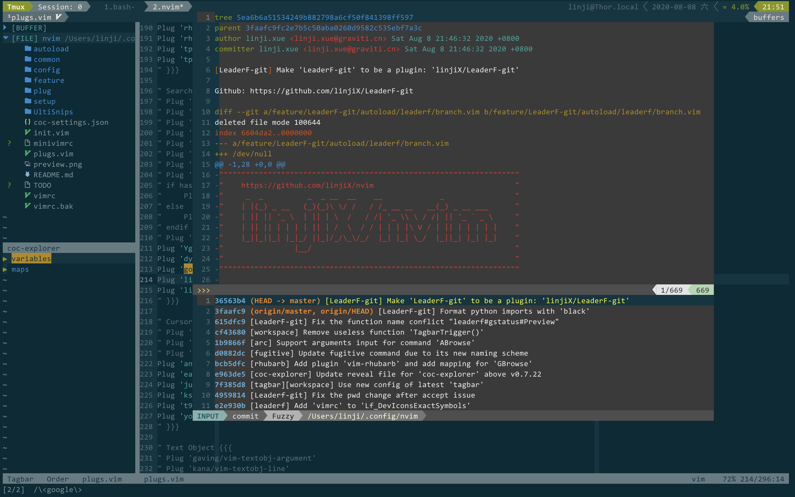

# LeaderF-git

[LeaderF](https://github.com/Yggdroot/LeaderF) extension for git



## Features

Provide 5 more git related LeaderF commands:

1.  `:LeaderfBranch` (or `:Leaderf branch`)
    -   Fuzzy finder for all local git branches
2.  `:LeaderfCommit` (or `:Leaderf commit`)
    -   Fuzzy finder for all the commits in current git repository
3.  `:LeaderfBCommit` (or `:Leaderf bcommit`)
    -   Fuzzy finder for all the commits which affects current file
4.  `:LeaderfGstatus` (or `:Leaderf gstatus`)
    -   Fuzzy finder for the files in `git status`
5.  `:LeaderfGfile` (or `:Leaderf gfile`)
    -   Fuzzy finder for the files in `git ls-gfiles`,

## Installation

with [vim-plug](https://github.com/junegunn/vim-plug)

```vim
Plug 'linjiX/LeaderF-git'
```

## Requirments

-   Mandatory
    -   [git](https://git-scm.com)
    -   [Yggdroot/Leaderf](https://github.com/Yggdroot/LeaderF)
-   Optional
    -   [tpope/vim-fugitive](https://github.com/tpope/vim-fugitive) (Needed for open or preview git commits)

## References

This extension is written by pure vim-script: [Written LeaderF extension by vim-script](https://github.com/Yggdroot/LeaderF/issues/144#issuecomment-540008950)
